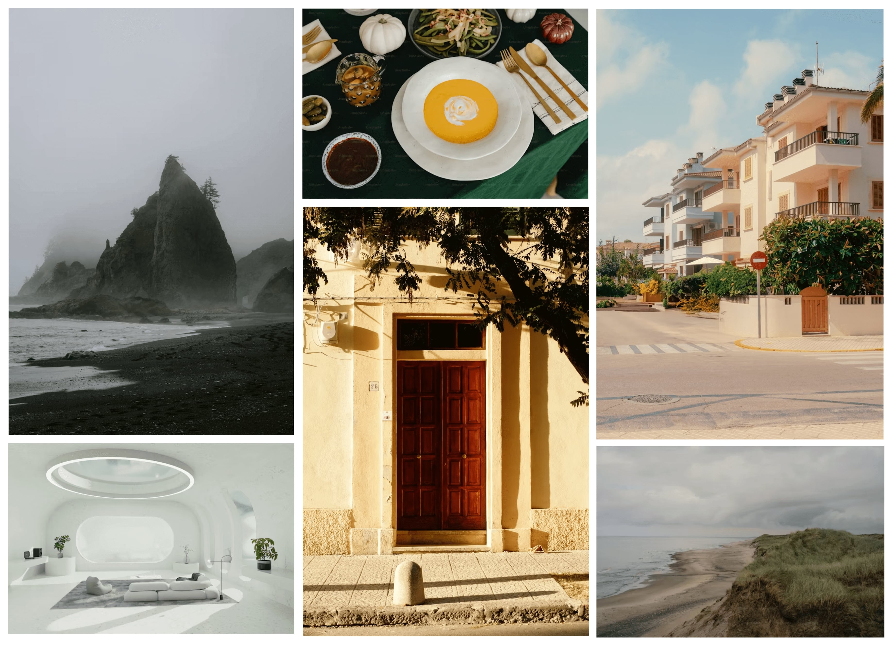

# Image Grid Layout

## Description
The **Image Grid Layout** project is a hands-on exercise aimed at helping developers practice creating responsive image grids using **CSS Grid**. This project consists of six images, arranged in a dynamic grid layout, including scenes like a foggy beach, a modern living room, a food table, a red-doored building, apartment buildings, and a beach view from a hill.

This project is inspired by a task listed on [roadmap.sh](https://roadmap.sh/projects/image-grid), a platform that offers guidance for learning web development. It is ideal for gaining experience with **CSS Grid**, responsive design, and image optimization. The layout adjusts to different screen sizes, ensuring flexibility and a user-friendly experience across devices.

## Features
- **CSS Grid Structure:** Learn to define grid containers, rows, columns, and place items within the grid.
- **Responsive Design:** The layout dynamically adapts to various screen sizes, from desktops to mobile devices.
- **Image Optimization:** Images use `object-fit: cover` to maintain a consistent aspect ratio without distortion.
- **Mobile-friendly:** A single-column layout is applied for screens under 850px width.
- **Cross-browser Support:** Compatible with all major web browsers.

## Visuals
Below is a screenshot of the **Image Grid Layout** in action:



## Installation
To run this project locally, follow these steps:

1. Clone the repository:
   ```bash
   git clone https://github.com/Yashi-Singh-9/Image-Grid-Layout.git
   ```
2. Navigate to the project folder:
   ```bash
   cd image-grid-layout
   ```
3. Open the `index.html` file in your browser to view the grid layout:
   ```bash
   open index.html
   ```

No additional dependencies are required.

## Usage
The grid layout can be customized or extended for various use cases:
- Replace the images by updating the image URLs in the `index.html` file.
- Modify the grid structure and styling using CSS in the `styles.css` file.
- Test the responsiveness by viewing the layout on devices of different sizes.

## Support
For support, open an issue in the [GitLab repository](https://github.com/Yashi-Singh-9/Image-Grid-Layout/-/issues).

## Roadmap
Future improvements may include:
- Adding interactive animations and hover effects.
- Utilizing `grid-template-areas` for more complex layouts.
- Dark mode support.

## Contributing
Contributions are welcome! To contribute:
1. Fork the repository.
2. Create a new branch (`git checkout -b feature-branch`).
3. Make your changes.
4. Commit your changes (`git commit -m 'Add some feature'`).
5. Push to the branch (`git push origin feature-branch`).
6. Open a pull request.

## Authors and Acknowledgments
Created by **Yashi Singh**. Special thanks to [roadmap.sh](https://roadmap.sh) for providing the project inspiration.

## License
This project is licensed under the [MIT License](LICENSE). See the `LICENSE` file for more details.

## Project Status
The project is complete and open for contributions. Feel free to fork the repository or reach out if you'd like to contribute or maintain the project.
